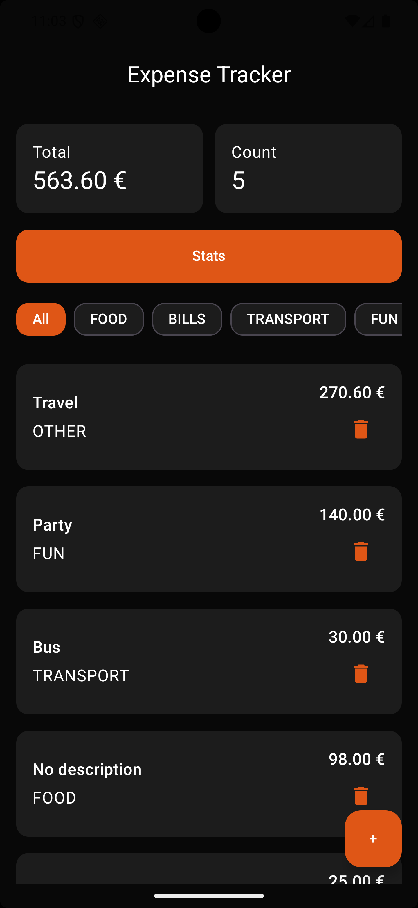
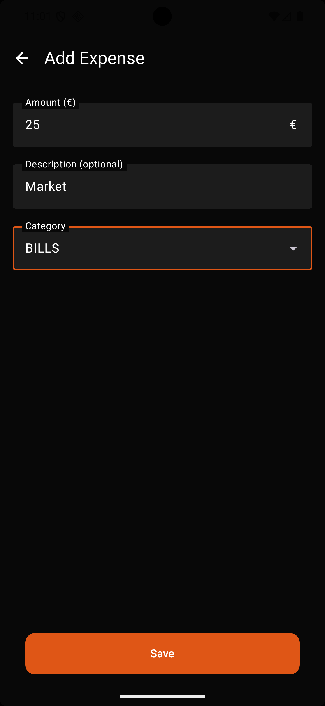
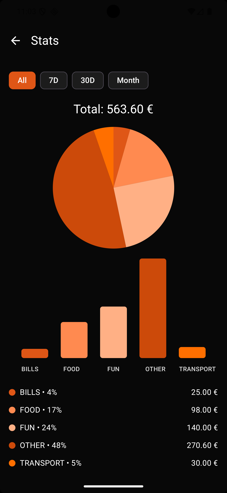
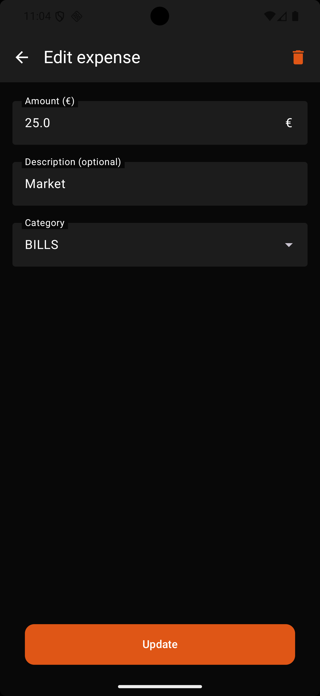

# Jetpack Compose Tutorijal: Expense Tracker
### (Room + MVVM + Charts)

> Android aplikacija za praćenje ličnih troškova razvijena korišćenjem **Jetpack Compose** framework-a.

---

## O projektu

Ovaj projekat predstavlja praktičan primer razvoja moderne Android aplikacije za praćenje ličnih troškova (**Expense Tracker**) korišćenjem **Jetpack Compose**-a.

Cilj projekta je da se kroz realnu aplikaciju prikažu:
- prednosti deklarativnog UI pristupa
- smanjenje boilerplate koda u odnosu na XML
- jasna arhitektura i organizacija Compose ekrana
- lakše održavanje i proširivanje aplikacije

Aplikacija omogućava unos, izmenu, brisanje i pregled troškova, kao i vizuelni prikaz statistike kroz grafikone.

---

## Problemi

U realnim Android projektima, razvoj korisničkog interfejsa često nailazi na sledeće probleme:

- UI brzo postaje kompleksan  
  (više ekrana, liste, filteri, dijalozi, forme)
- Kod XML-a često imamo:
    - odvojene XML fajlove + binding kod
    - manuelna ažuriranja UI-ja
    - RecyclerView + adaptere
    - notifyDataSetChanged
    - findViewById / ViewBinding
- Upravljanje stanjem je otežano:
    - loading stanja
    - prazna stanja
    - validacije
    - filteri
- Refaktorisanje UI-ja je sporo jer je UI razdvojen između XML-a i Kotlin koda

---

## Zašto Jetpack Compose rešava ove probleme

Jetpack Compose je moderni deklarativni UI toolkit za Android.

Jetpack Compose omogućava:

- deklarativni pristup (UI = funkcija stanja)
- manje boilerplate koda
- nema XML fajlova
- lakšu ponovnu upotrebu komponenti
- automatsko ažuriranje UI-ja

Jetpack Compose nudi deklarativni UI, što omogućava da UI bude funkcija stanja i automatski reaguje na promene, za razliku od klasičnog XML pristupa. Ovo ga čini pogodnijim od tradicionalnih Android tehnologija i konkurentnijim rešenjima kao što su Flutter ili React Native.

---


## Jetpack Compose vs XML
| XML                    | Jetpack Compose     |
| ---------------------- | ------------------- |
| XML layout fajlovi     | Kotlin funkcije     |
| RecyclerView + Adapter | LazyColumn          |
| Ručni update UI-ja     | Automatski          |
| Više boilerplate koda  | Manje koda          |
| Sporije izmene         | Brže refaktorisanje |

---

## Funkcionalnosti

### Home ekran
- prikaz ukupne potrošnje
- broj unetih troškova
- filteri po kategorijama
- lista troškova:
    - opis
    - kategorija
    - iznos (€)
    - ikonica za brisanje
- empty state ako nema podataka

### Dodavanje troška
- unos iznosa (€)
- opis (opciono)
- izbor kategorije (dropdown)
- validacija (iznos > 0)
- snackbar potvrda

### Izmena troška
- unapred popunjena forma
- izmena podataka
- brisanje uz dijalog potvrde

### Statistika
- izbor vremenskog opsega:
    - svi troškovi
    - poslednjih 7 dana
    - poslednjih 30 dana
    - tekući mesec
- pie chart
- bar chart
- legenda (kategorija + procenat + iznos)
- empty state ako nema podataka

---

## Nefunkcionalni zahtevi

- čista i čitljiva arhitektura (MVVM)
- trajno čuvanje podataka (Room)
- konzistentan UI:
- jednostavno pokretanje projekta

---

## Korišćene tehnologije

- **Kotlin**
- **Jetpack Compose**
- **Material 3**
- **Navigation Compose**
- **Room**
- **ViewModel**
- **Coroutines**
- **Flow / StateFlow**

---

## Arhitektura (MVVM)

Aplikacija koristi **MVVM** arhitekturu.

### Slojevi:
- **UI (Compose)** – prikazuje podatke i reaguje na stanje
- **ViewModel** – čuva UI stanje i poslovnu logiku
- **Repository** – jedinstvena tačka pristupa podacima
- **Room** – lokalna baza podataka

### Zašto MVVM + Compose?

Compose prirodno radi sa **Flow / StateFlow**:
- ViewModel emituje stanje
- UI automatski reaguje
- nema manuelnih UI ažuriranja

---

## 8) Model podataka (Room)

Svaki trošak se čuva u Room bazi.

### Polja:
- `id: Long`
- `amount: Double`
- `description: String`
- `category: ExpenseCategory`
- `createdAtMillis: Long`

### DAO operacije:
- observe sve troškove
- insert / update / delete
- observe trošak po ID-ju

---

## Upravljanje stanjem u Compose-u

Compose koristi **state-driven UI**:
- UI čita stanje
- promena stanja → recomposition

U projektu:
- `ExpenseViewModel` izlaže:
    - `allExpenses`
    - filtrirano stanje za Home ekran
- Stats ekran koristi sve troškove, nezavisno od filtera

---

## Struktura projekta

```text
app/src/main/java/com/example/expensetracker/
├── data/
│   ├── local/
│   │   ├── AppDatabase.kt
│   │   ├── DbProvider.kt
│   │   ├── ExpenseDao.kt
│   │   ├── ExpenseEntity.kt
│   │   └── ExpenseConverters.kt
│   │
│   ├── repository/
│   │   └── ExpenseRepository.kt
│   │
│   └── ExpenseCategory.kt
│
├── ui/
│   ├── components/
│   │   ├── PrimaryOrangeButton.kt
│   │   ├── ExpenseOutlinedTextField.kt
│   │   ├── ExpenseTextField.kt
│   │   ├── CategoryDropdown.kt
│   │   ├── ExpenseBarChart.kt
│   │   ├── PieChart.kt
│   │   ├── HomeComponents.kt
│   │   └── StatsComponents.kt
│   │
│   ├── screens/
│   │   ├── HomeScreen.kt
│   │   ├── AddExpenseScreen.kt
│   │   ├── EditExpenseScreen.kt
│   │   └── StatsScreen.kt
│   │
│   ├── navigation/
│   │   └── Routes.kt
│   │
│   └── theme/
│       ├── Color.kt
│       ├── Theme.kt
│       └── Type.kt
│
├── util/
│   ├── Currency.kt
│   └── MoneyFormatter.kt
│   └── PieColors.kt
│
├── ExpenseUiState.kt
├── ExpenseViewModel.kt
├── ExpenseVmFactory.kt
├── ExpenseTrackerApp.kt
└── MainActivity.kt
```

---

## Reusable UI komponente

Jetpack Compose omogućava lako izdvajanje i ponovnu upotrebu UI elemenata.
U ovom projektu izdvojene su sledeće komponente:

- **PrimaryOrangeButton**  
  Jedinstven stil dugmeta korišćen kroz celu aplikaciju.

- **ExpenseOutlinedTextField**  
  Centralizovan stil input polja (boje, ivice, fokus).

- **CategoryDropdown**  
  Wrapper oko Material 3 dropdown-a koji uklanja boilerplate kod.

- **Charts (Canvas)**
    - Pie chart – raspodela potrošnje po kategorijama
    - Bar chart – uporedni prikaz potrošnje
---


## Stringovi i lokalizacija

Svi stringovi korišćeni u aplikaciji nalaze se u:
```kotlin
app/src/main/res/values/strings.xml
```
Primer korišćenja u Jetpack Compose-u:

```kotlin
Text(text = stringResource(R.string.stats))
```
---

## Pokretanje projekta

### Zahtevi
- Android Studio
- JDK 17
- Emulator ili fizički Android uređaj (**API 24+**)

### Koraci

1. Klonirati repozitorijum:
   ```bash
   git clone https://github.com/USERNAME/ExpenseTracker.git

2. Otvoriti projekat u Android Studio

3. Sačekati da se Gradle sinhronizuje

4. Pokrenuti aplikaciju na emulatoru ili fizičkom uređaju
---

## Screenshot aplikacije

### Početni ekran (Home)


---

### Dodavanje troška


---

### Statistika potrošnje


---

### Izmena troška


---

## Zaključak

Jetpack Compose se pokazao kao efikasan alat za razvoj modernih Android aplikacija.
Kroz razvoj Expense Tracker aplikacije demonstrirano je da deklarativni UI pristup
značajno pojednostavljuje kod, olakšava održavanje i omogućava brže iteracije u razvoju.
